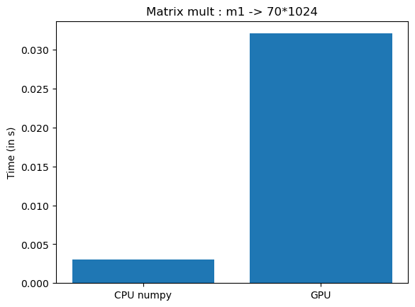
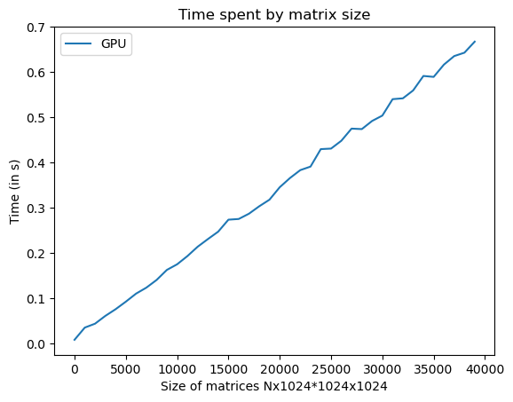

# GPU vs CPU | Machine learning

Comparison between my CPU and my GPU, with an application on machine learning.  
Note that this comparison was done on my own computer, results may vary from one configuration to another.

Several comparisons are performed: array incrementing, matrix multiplication, and training a VGG deep learning model to classify CIFAR-10.

## Config

### CPU

AMD Ryzen 5 5600H 3.30 Ghz

### GPU

NVIDIA GeForce RTX 3060 Laptop

## Paralleling

I used numba CUDA for python to access GPUs. Every experiment is implemented in Python.  
For the deep learning experiment, I used Tensorflow Keras, and a VGG architecture.

## CPU vs GPU : Incrementation

Comparison between my GPU and my CPU when incrementing an array.  

Time spent to increment an array of size 10000:  

Time spent to increment an array depending on the size of the array:  

Unsurprisingly, except for a very small size, it is the GPU that performs best.

## CPU vs GPU : Matrix multiplication

Comparison between my GPU and my CPU when multipling two matrices.  

Time spent to multiply two matrices of size 50x50:  

Time spent to multiply matrices depending on their size:  

## CPU vs GPU : Numpy arrays

What I realized is that for the same Python implementation, my GPU outperforms my CPU. However, the Python Numpy package implements much faster matrix multiplication using a lower level of code, like C. Therefore, a parallelized multiplication of my code in Python, is not necessarily faster than a matrix multiplication on the CPU with numpy methods.

Multiplication of two matrices 10000x1024 and 1024x1024:  

Time spent to multiply matrices depending on their size:  

## Benchmark with google collad GPU

I also wanted to compare my GPU with Google Collab's, just for fun.  
I ended up slightly outperforming the Google GPU.

### Google GPU

NVIDIA Tesla T4

### Google performance

### My own GPU performance

## Deep Learning

## Max running threads

Execution speed of 1'000'000'000 instructions depending on the CUDA grid size.  
For my own GPU.  

